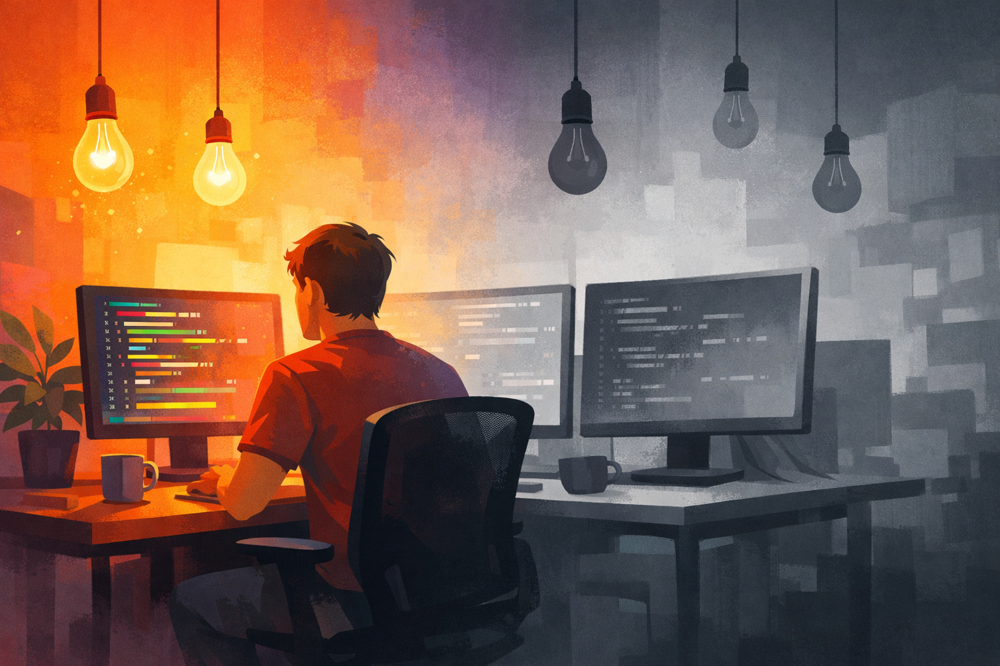
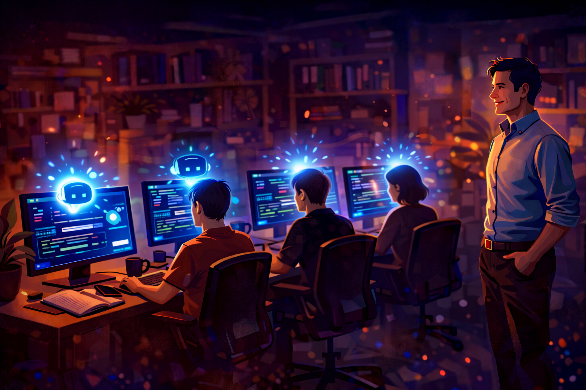

There's a feeling you get early in your career when you're building something and it works. Not the polished, reviewed, tested, deployed kind of works. The scrappy, 2am, "I can't believe that actually worked" kind. The kind where you forget to eat because the problem is interesting and the feedback loop is fast.

I hadn't felt that in years.

## What seniority quietly takes away

Early in your career, staying current is almost effortless. You're immersed in it. Every ticket is a learning opportunity. Every new framework is something you try on the weekend because it sounds cool. The gap between having an idea and seeing it run is small, and that small gap is where the excitement lives.

Then seniority happens.

You get broader. You're expected to think in systems, not syntax. You design architectures rather than implement them. You're in meetings about roadmaps, not debugging sessions. The value you bring shifts from "I can build this" to "I can tell you what we should build and roughly how." You could always look up the exact Kubernetes command or the right Spring Boot annotation. That wasn't the point anymore.

This is a natural and necessary evolution. I don't regret it. But somewhere along the way, something else happened too. The excitement of implementing an idea, of going from thought to working code quickly, mellowed down. It didn't vanish overnight. It just... receded.

Changes took longer. There was more to consider. More things that could break. More standards to meet. "Don't fix it if it ain't broke" slowly became "does this new feature really bring enough value to justify the effort?" Reasonable questions, all of them. But they add friction. And friction is the enemy of excitement.

## What changed

Over the past year, I've been using AI tools daily. [Claude Code](https://claude.ai/code) for development, [Copilot](https://github.com/features/copilot) for autocomplete, [ChatGPT](https://chatgpt.com/) for research. Not as a novelty, but as a core part of how I work.

And something unexpected happened. That feeling came back.

Not because AI writes code for me. It's more fundamental than that. The gap between idea and implementation collapsed. The thing that seniority had slowly widened, AI compressed back down.

Here's what I mean, concretely:

**I don't have to remember things I used to dread forgetting.** The exact `kubectl` command to debug a pod. The Terraform syntax for a specific resource. The right way to configure a Spring Boot health check. These aren't hard problems, but they're friction. They slow you down just enough to break your flow. Now they don't.

**I can read unfamiliar code at the speed I think.** Someone else's codebase used to mean hours of tracing call chains and reading documentation that was probably outdated. Now I can point at a module and ask "what does this do and why?" and get a useful answer in seconds. I can do the same with my own code from two years ago, which is honestly more embarrassing but equally useful.

**Deep investigations take a day, not a week.** The kind of problem where you're piecing together logs, reading source code for a library you didn't write, and building a mental model of something complex. AI doesn't solve these for you, but it's like having a research assistant who never gets tired and has read everything.

**Documentation stopped being a chore.** I can generate a requirements doc, write a post-mortem, or produce a technical brief before handing a problem to specialists. The writing still needs my judgment and my voice, but the scaffolding appears instantly.

**I can build things I couldn't before.** I'm decent at APIs. I'm terrible at UI. That used to mean any tool I built for my team was a CLI or a Swagger page. Now I can put a proper interface in front of an API in an afternoon. Not beautiful, but functional and approachable. That's a capability I simply didn't have before.

## The timeline collapsed

The pattern across all of these is the same: the distance from inception to implementation got shorter. From hypothesis to validation. From "I wonder if..." to "here, try this."

When I was a junior engineer, that distance was short because I didn't know enough to worry about all the things that could go wrong. When I became senior, the distance grew because I knew too much. Every idea came with a mental checklist of risks, edge cases, and maintenance burdens.

AI didn't make those concerns disappear. They're still valid. But it made the cost of trying something so low that the calculus changed. You can validate an idea before you've committed to it. You can build a prototype in an hour and decide if it's worth doing properly. The expensive part, the thinking, the architecture, the judgment, that's still yours. The tedious part got faster.

## What this means for engineering leaders

If you're an EM or a senior engineer reading this, there's a broader point here. The people on your teams are experiencing this too, or they will be soon. The engineers who adopt these tools aren't being lazy. They're getting back the thing that made them love engineering in the first place: the fast feedback loop between idea and result.

Your job is to make space for that. To update your mental model of how long things "should" take. To not mistake speed for recklessness. To recognise that the engineer who prototyped something in an afternoon isn't cutting corners. They might just be excited again.

And honestly? If you haven't tried using these tools yourself, deeply, not just casually, you should. Not because it's trendy. Because you might find that the thing you thought seniority had permanently taken from you is still there, waiting for the friction to drop low enough to let it through.

Exciting times ahead.
