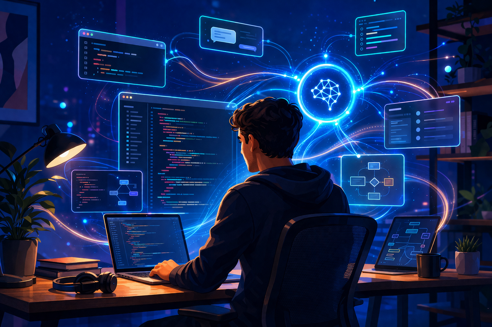

There’s a particular kind of energy early in an engineering career. A quiet obsession. A willingness to sit with a problem for hours, chasing it down rabbit holes until something finally clicks

Lately, that feeling has been… back.

Not in a nostalgic, “good old days” sense, but in a very real and present way. And it shows up in small, almost mundane moments. I no longer hesitate before diving into something because I’ve forgotten the exact command or syntax. I don’t feel that low-grade friction that used to slow me down just enough to lose momentum.

And the catalyst is hard to ignore: **AI**.

## The Slow Fade

As engineers grow, so does the scope of their responsibility. Early on, your world is narrow and deep. You’re close to the code, familiar with the tools, and able to keep up with the pace of change because your surface area is limited.

But seniority reshapes the job. You zoom out from syntax to systems, from implementation to architecture, from “how does this work?” to “should this exist at all?” Your value shifts toward judgment, tradeoffs, and experience.

With that shift comes a subtle but important change in energy. The excitement of building gets replaced by the responsibility of protecting. Questions start to dominate your thinking: will this break something, is it worth the effort, does this truly add value? Over time, velocity slows, not because of a lack of capability, but because of an increased awareness of risk.

“Don’t fix what isn’t broken” gradually evolves into “is this even worth touching?” The spark doesn’t disappear, but it does get buried under layers of context, caution, and responsibility.

## The Turning Point

Then AI shows up, and something shifts. Not everything, but enough to change how it feels to work again.

The biggest change isn’t just speed. It’s access. AI reduces the friction that accumulates over years of working across systems, tools, and domains. It removes many of the small but persistent barriers that slow you down and pull you out of flow.

## What Actually Changed

With AI in the loop, a lot of the cognitive overhead starts to fade. The shift isn’t abstract, it shows up in very real, everyday ways.

**I don’t have to remember things I used to dread forgetting.** The exact kubectl command, a Terraform snippet, or how to configure a Spring Boot health check. These were never hard problems, just small points of friction that broke flow. Now they don’t.

**I can read unfamiliar code at the speed I think.** What used to take hours of tracing call chains and second-guessing documentation now takes minutes. I can ask what a module does and why, and get a useful answer immediately. The same applies to my own code from years ago, which is equally helpful and occasionally humbling.

**Deep investigations have compressed dramatically.** The kind of work that involved stitching together logs, reading library code, and slowly building a mental model still requires thought, but AI acts like a tireless research assistant. You’re still solving the problem, just without the drag.

**Documentation has also lost its weight.** Requirements docs, post-mortems, and technical briefs can be scaffolded instantly. The thinking and judgment are still mine, but the effort to get started is gone.

And **I can build things I couldn’t before.** I’ve always been comfortable with APIs but weak on UI, which meant most internal tools stopped at a CLI or Swagger page. Now I can put a functional interface in front of an API in an afternoon. Not polished, but usable, and that alone changes who can benefit from what I build.

In essence, AI acts like a second layer of cognition. It handles the mechanics so I can stay focused on intent, spend more time in the problem space, and maintain flow instead of constantly breaking it.

## The Timeline Collapses

One of the most noticeable shifts is how dramatically the timeline from idea to execution has shortened. Previously, moving from an idea to a working implementation involved a long and often winding path: research, trial and error, debugging, validation, and finally, delivery.

Now, that path feels much more direct. You can move from hypothesis to validation quickly, prototype without committing significant effort, and explore ideas without the usual cost of failure. The steps are still there, but they’re compressed.

The distance between thinking something and seeing it work has shrunk, and that changes how you approach problems. You’re more willing to explore, to test, and to iterate because the penalty for being wrong is much lower.

## Why This Matters More for Senior Engineers

Interestingly, this shift has an outsized impact on senior engineers. Over time, many experienced engineers naturally move away from hands-on implementation and toward higher-level responsibilities. While that shift is necessary, it can also create distance from the part of the work that initially made engineering exciting.

AI helps bridge that gap. It allows you to re-engage with implementation without losing the broader perspective you’ve developed. You can validate ideas quickly before committing team resources, experiment without disrupting existing systems, and connect architectural thinking more directly to execution.

In many ways, it restores a balance that was gradually lost. You still operate at a high level, but you’re no longer blocked from diving deep when needed.

### The Return of Flow

One of the most meaningful outcomes of all this is the return of flow. That state where you’re fully immersed in a problem, where time fades into the background, and where progress feels natural and continuous.

For many senior engineers, that state had become increasingly rare, replaced by meetings, coordination, and decision-making. Those things don’t go away, but AI reduces the friction enough to make space for flow again.

And when that happens, the work feels different. Lighter, faster, and more engaging.

## What This Means for Leaders

For engineering leaders, this shift is about more than just productivity gains. It has cultural implications. When engineers can move faster and with less friction, they’re more likely to experiment, share ideas, and take ownership.

Your role evolves in response. It becomes less about controlling execution and more about enabling momentum. Less about gatekeeping, and more about creating the conditions where teams can explore and build with confidence.

Teams that lean into this shift won’t just deliver faster. They’ll operate differently. There will be more curiosity, more iteration, and a stronger sense of engagement with the work itself.

## Closing Thought

For a long time, experience required trading speed for wisdom. That tradeoff made sense in a world where execution was inherently slow and costly.

Now, that balance is changing.

I can pick up an unfamiliar codebase and understand it in minutes. I can validate an idea in an afternoon that might have taken days before. I can build things that used to sit just outside my skill set. None of this removes the need for judgment or experience, but it removes just enough friction to make those things more usable.

You can retain the perspective that comes with experience while regaining the speed and curiosity you had earlier in your career. And that combination is what makes this moment so compelling. 

Exciting times ahead!

---

*AI was used to generate the illustrations in this post*