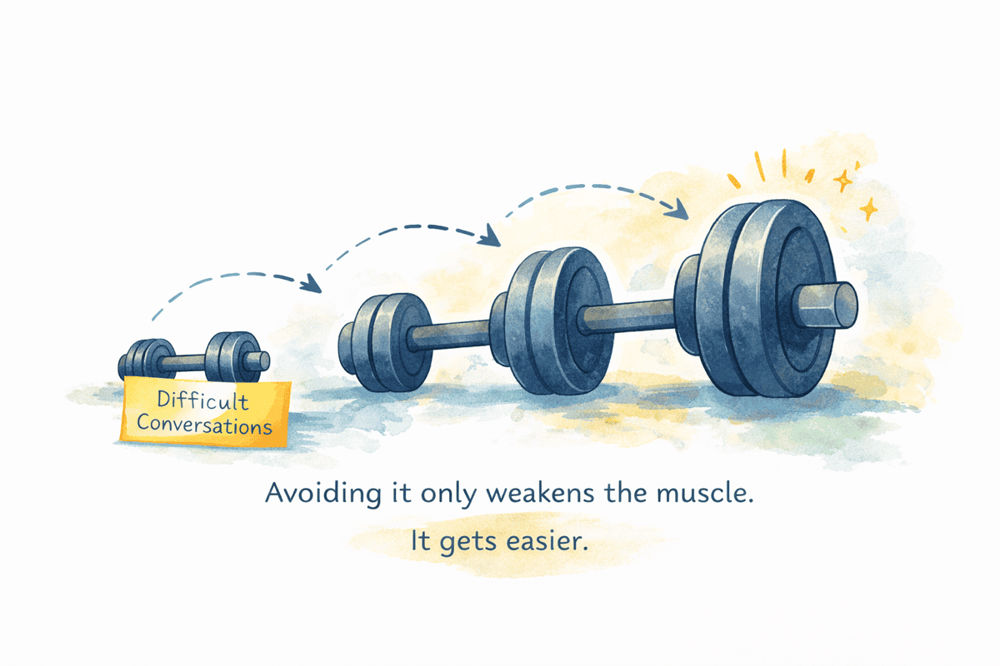

_This post was originally published on the [Meltwater Under the Hood engineering blog](https://underthehood.meltwater.com/blog/2026/03/05/senior-engineer-to-engineering-manager/)._

In August 2018, I joined Meltwater as a Senior Software Engineer. I liked the clarity of the job: build things, fix things, improve things. Merge clean pull requests. Watch tests turn green. My world was tangible. My output was visible. My success was measurable. Management was something other people did.

In January 2022, I became Team Lead for my team, Wrapidity. We were doing machine-learning-based web data extraction. At the time, I didn't see it as the first step toward becoming an Engineering Manager. I saw it as an experiment. The role was framed as a 50/50 split: half coding, half people and planning. A transition role. A way to explore leadership without fully committing. That framing made it feel safe.

Experiments, however, have a way of becoming commitments.

## Act I: Becoming a Leader

This was a team I was already familiar with and had an existing good relationship with everyone. The early months were energizing. New meetings. Roadmap ownership. Process improvements. Influence. I had ideas, lots of them, about things we could clean up and systems we could refine. Then the real shift began.

"As a senior engineer, I was responsible for delivering my work. As a Team Lead, I was responsible for delivery, full stop." That meant clarity, coordination, morale, prioritization, and trade-offs. The first real lesson was humbling: you will always have more ideas than you can implement.

When you lead, you're no longer organizing your own world. You're navigating everyone else's too. Every improvement competes with deadlines, energy levels, and existing commitments. Not every good idea survives contact with reality. The question stopped being "Is this a good idea?" and became "Is this the most important thing right now?"

That shift alone changed how I thought about impact.

The second shift was more personal: I had to code less. Meetings multiplied. Context switching became constant. My sprint tickets began slipping. A mentor gave me advice that stuck: "Stop trying to be the primary driver of tickets. Let others lead. Support them."

It bruised my ego, but it made me better at the job. My output slowly shifted from "what I ship" to "what the team ships." That change sounds small. It isn't.

## Act II: Taking Over a New Team

After a year leading Wrapidity, as part of an internal restructure, I was asked to lead the Web Crawler team, Team Huntsman. Leading a new team is different from growing into leadership with a team. You inherit history, trust dynamics, unwritten rules, and decisions made before you arrived.

The temptation in a new environment is to fix things quickly, to justify your presence through visible change. I learned to resist that impulse. Instead, I listened. I asked why things were the way they were. I observed how decisions were made and how conflict was handled. I consciously avoided making too many changes before earning the team's trust.

If Wrapidity taught me how to lead, Huntsman taught me how to enter a system without destabilizing it.

During these two years, the 50/50 split quietly drifted. I was still close to technical discussions, but my calendar was filled with hiring conversations, performance reviews, cross-team alignment, and long-term planning. Hard conversations became unavoidable. At first, they were uncomfortable. I overprepared. I replayed them afterward. I worried about damaging relationships.

Over time, I learned that hard conversations are a muscle. Avoiding them weakens it. Exercising it strengthens it. Clarity, delivered with empathy, is kinder than silence.

Another lesson emerged during this period. When unpopular decisions come down from senior leadership — budget constraints, shifting priorities, headcount changes — there's a temptation to distance yourself from them. To imply, "I know, I disagree too." It feels like solidarity. It's actually self-protection.

Blaming upward doesn't make your team feel better. It doesn't change the decision. It just shields you from discomfort. Leadership means absorbing tension, explaining the reasoning as clearly as possible, and helping the team navigate forward. You don't get to opt out of ownership when things are hard.

## Act III: Leading Multiple Teams

At the beginning of 2025, Wrapidity and Huntsman were combined under a new umbrella: Content Crawlers. I became the Engineering Manager for the combined group.

This wasn't just more scope. It was a shift in identity.

Leading one team allows you to remain partly a player-coach. Leading multiple teams forces you to think in systems. You cannot be the glue between every thread. You must design structures that function without you at the center of everything.

By this stage, the transition was complete. My output was no longer code, nor just delivery. It was an environment: clarity of priorities, alignment across teams, sustainable pace, hiring the right people, and growing future leaders. The work became less visible and more consequential.

Looking back, the journey wasn't a leap but a series of identity shifts: from solving problems to defining the right problems; from executing plans to designing systems; from owning tickets to owning outcomes; from writing code to growing people who write code. The technical curiosity never left. It simply zoomed out.

I used to optimize for correctness. Now I optimize for sustainability. I used to measure progress in commits. Now I measure it in clarity, stability, and growth. The problems are still engineering problems. They just include humans.

## The Long Way Around Was the Right Way

If I had jumped directly from Senior Engineer to Engineering Manager, I would have missed critical steps. Wrapidity taught me to move from individual output to shared responsibility. Huntsman taught me to enter and stabilize complex systems. Content Crawlers is teaching me to design systems that scale beyond me.

None of those skills arrived fully formed. They were built through uncomfortable conversations, trade-offs, mistakes, mentorship, and time.

The Team Lead role wasn't a detour. It was the bridge.

And if you're a senior engineer wondering whether to step into leadership, the real question isn't whether you want to manage. It's whether you want to shape the environment in which engineering happens — the clarity, the culture, the standards, the growth, the sustainability.

Because at some point, the most interesting engineering problem in the room might not be the codebase.

It might be the system that builds it.